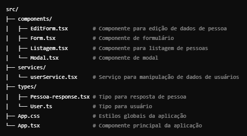

# Cadastro de Pessoas

Este é um projeto React para cadastro, edição e exclusão de dados de pessoas. Ele foi criado com o Vite, utilizando TailwindCSS para o design e PostCSS para otimização de CSS. A aplicação permite realizar operações CRUD (Criar, Ler, Atualizar e Deletar) nos dados de pessoas.

## Funcionalidades

- **Cadastro**: Permite adicionar uma nova pessoa com nome, idade e outras informações relevantes.
- **Edição**: Permite editar os dados de uma pessoa já cadastrada.
- **Exclusão**: Permite excluir uma pessoa do cadastro.

Além disso, o projeto também faz uso da biblioteca `date-fns` para manipulação de datas, garantindo que as informações sejam tratadas corretamente.

## Tecnologias Utilizadas

- **React**: Biblioteca JavaScript para construção da interface.
- **Vite**: Ferramenta de build rápida e otimizada.
- **TailwindCSS**: Framework utilitário para criação de designs responsivos.
- **PostCSS**: Ferramenta para transformação de CSS.
- **autoprefixer**: Para garantir compatibilidade entre os navegadores.
- **date-fns**: Biblioteca para manipulação de datas.


## Arquitetura


## Pré-requisitos

Certifique-se de ter o Node.js instalado em sua máquina. Você pode verificar se já o tem instalado com o seguinte comando:

```bash
node -v
